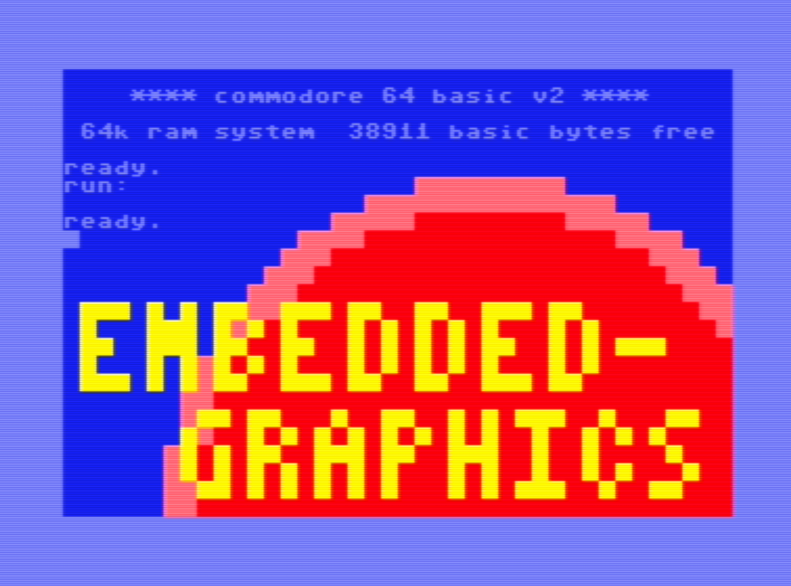

# Embedded Display Drivers for Retro Computers

[`Embedded-graphics`](https://crates.io/crates/embedded-graphics)
display drivers for retro computers from Commodore, Atari, Nintendo etc.
This can be used to run embedded graphics on very old hardware and access
geometric shapes, large fonts etc.
The screenshot below shows an example running on the
[Commodore 64](https://en.wikipedia.org/wiki/Commodore_64) from 1982.

## Status

- Commodore 64:
  - [x] Simple PETSCII color display driver (40 x 25 character "pixels")
  - [x] VIC-II color palette with `const` conversion from/to `embedded-graphics` colors
  - [ ] Bitmapped display driver

## Getting Started

The project requires [rust-mos](https://github.com/mrk-its/rust-mos) and a docker image is available:
[mrkits/rust-mos](https://hub.docker.com/r/mrkits/rust-mos).
See also the [llvm-mos wiki](https://llvm-mos.org/wiki/Rust).

### Docker and Visual Studio Code

The easiest way is to use the provided `.devcontainer.json` configuration for Visual Studio Code.
Before starting up VSC, you may want to edit `.devcontainer.json` to point to a recent, tagged image of `mrkits/rust-mos`.
In particular, if you're on an ARM architecture, e.g. Apple Silicon, make sure to use an image compiled for
`linux/arm64` as emulating x86 in Docker is painfully slow.

1. Install and start [Docker](https://www.docker.com/products/docker-desktop/)
2. Configure Visual Studio Code with the _Remote - Containers_ extension:
   ~~~ bash
   cd retro-display/
   code --install-extension ms-vscode-remote.remote-containers
   code .
   ~~~
   When asked, re-open in _Dev container_.
3. Inside a VSC terminal, build with:
   ~~~ bash
   cargo build --release --target mos-c64-none  --example demo
   ~~~
4. Find the binary in `target/` and run in an emulator or transfer to real hardware.
